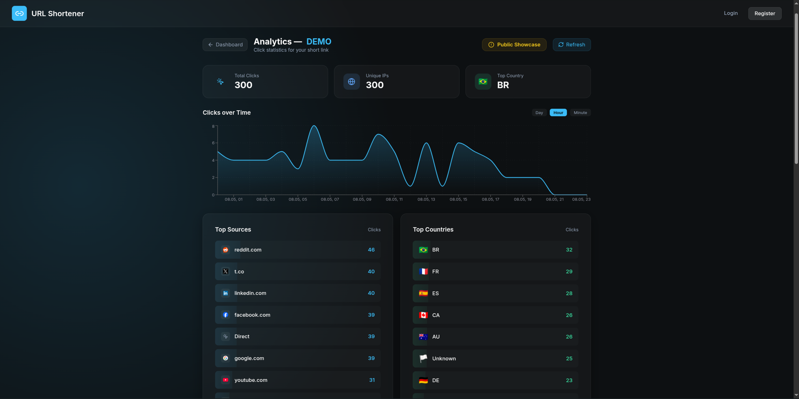
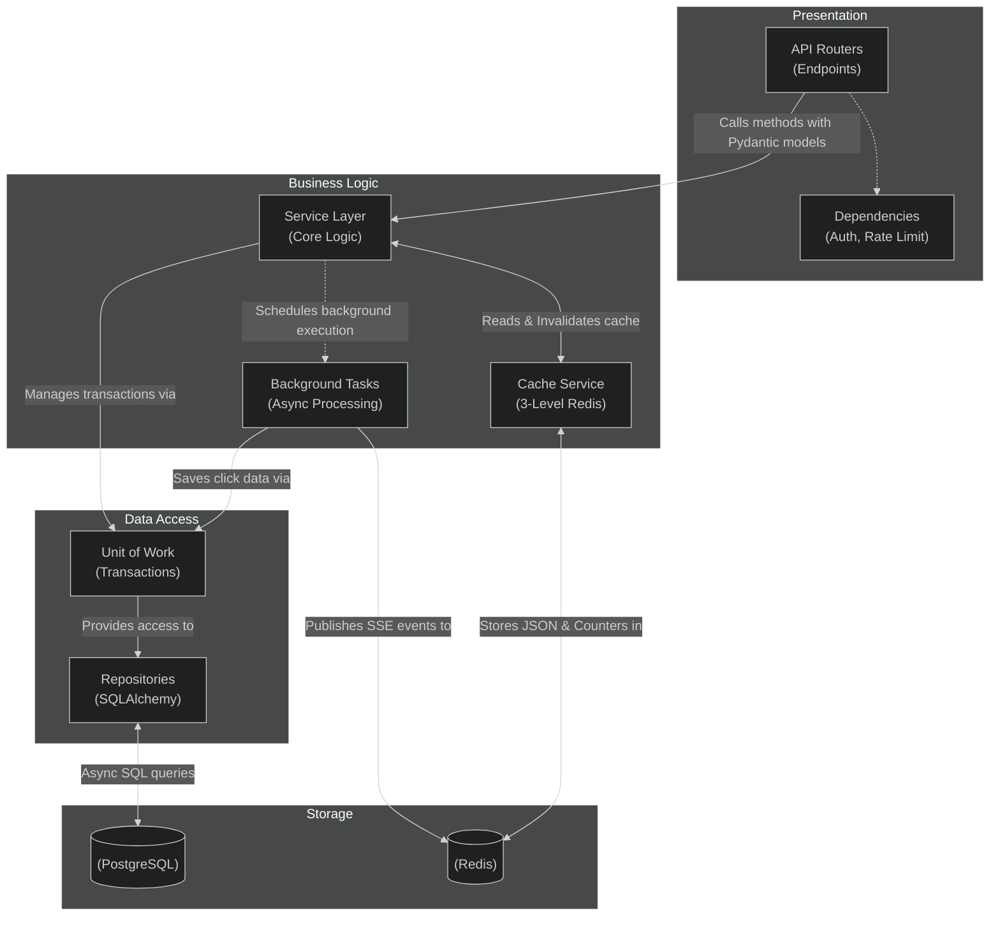

# URL Shortener

[](https://github.com/glikoliz/url-shortener/actions/workflows/backend.yml)
[](https://github.com/glikoliz/url-shortener/actions/workflows/frontend.yml)


A full-stack URL shortening service with real-time analytics, built with a focus on backend engineering best practices. Fully deployed and production-ready.

[](https://gliko-shorturl.vercel.app/links/DEMO/analytics)

## Architecture



## Tech Stack

### Backend (FastAPI) — Core Focus

* **Layered Architecture:** Strict separation of concerns following `API → Service → Repository → Model`. All business logic lives in the Service layer, keeping API handlers thin and focused on HTTP concerns.
* **Unit of Work Pattern:** Custom `AbstractUnitOfWork` implementation with nesting support that manages SQLAlchemy sessions and provides atomic transactions across multiple repositories (`users`, `links`, `clicks`).
* **Async Database:** Fully asynchronous PostgreSQL access via `asyncpg` + SQLAlchemy 2.0. Schema versioning handled through Alembic migrations.
* **Multi-level Redis Caching:** A dedicated `CacheService` with three independent cache layers, each with its own TTL policy:
  * **URL Redirect Cache** — fast-path resolution for shortened links, with TTL capped by link expiration.
  * **Stats Cache** — aggregated analytics with short TTL for near-real-time accuracy.
  * **User Links Cache** — per-user link lists with smart invalidation on create/delete/click events.
* **Hybrid Click Tracking:** Atomic Redis `INCR` for instant, lock-free counter updates. Detailed click events (IP, country, referer, User-Agent) are persisted to PostgreSQL asynchronously via `BackgroundTasks`, ensuring zero-latency redirects.
* **Real-time SSE:** Server-Sent Events stream built on Redis Pub/Sub. Each authenticated user subscribes to a personal channel, receiving live updates on link creation, deletion, and click count changes.
* **Security:**
  * JWT Access Tokens + Refresh Token Rotation with HttpOnly cookie storage (XSS-safe).
  * SSRF Protection: Deep URL validation — resolves final redirect targets and blocks requests to private/loopback/reserved IPs.
  * Background recursive link detection: asynchronously follows redirect chains to prevent self-referencing loops.
  * Bot filtering: click events from known crawlers are silently discarded to keep analytics clean.
  * Per-endpoint Redis-backed rate limiting.
* **Testing:** 93% code coverage across unit and integration tests. Unit tests use mocked UoW/Redis for isolation; integration tests run against real PostgreSQL and Redis via Testcontainers.

### Frontend (React + Vite)

* **State & Data Fetching:** TanStack React Query for synchronizing server state.
* **Real-time Data:** Live click statistics via SSE (`EventSource`) with auto-reconnection.
* **Codebase:** Custom Hooks (`useAuth`, `useSSESubscription`, `useDebounce`) and Context API for clean logic separation.

### Infrastructure & DevOps

* **Containerization:** Docker Compose setup optimized for low-resource environments with defined memory limits and LRU eviction policies.
* **CI/CD:** Two separate GitHub Actions pipelines with strict path-based triggers. Backend changes trigger the Backend Pipeline (Lint, Security Audit, Pytest -> VPS Deployment); frontend changes trigger the Frontend Pipeline (Lint, Build -> Vercel Deployment). Deployments only run if tests pass and are restricted to the `main` branch.
* **Networking:** Vercel Rewrites act as a Serverless Reverse Proxy to hide the backend IP and bypass CORS. Includes a `/ping` healthcheck endpoint for DB and Redis connectivity monitoring.

## Quick Start

Prerequisites: Docker & Docker Compose.

```bash
git clone https://github.com/glikoliz/url-shortener.git
cd url-shortener

# Set up environment variables
cp .env.example .env

# Run the application
docker compose up -d --build
```

The application will be available at:

* **Frontend:** `http://localhost:5173`
* **API & Docs:** `http://localhost:8000/docs`

Interactive API documentation is automatically generated:

* Swagger UI: `http://localhost:8000/docs`
* ReDoc: `http://localhost:8000/redoc`
